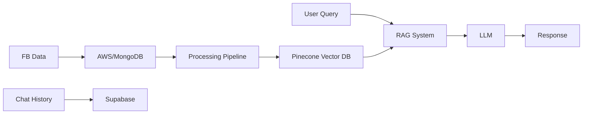

# RAG Chat Project

A conversational AI system leveraging Retrieval-Augmented Generation (RAG) to provide context-aware responses based on Q&A data from Facebook groups.

## 🌟 Features

- **RAG Implementation**: Uses LangChain framework for context-aware responses
- **Vector Database**: Pinecone for efficient similarity search of context data
- **Multiple LLM Support**: 
  - OpenAI GPT-4-turbo and GPT-4-turbo-mini
  - Future integration planned for Anthropic Claude and AWS Bedrock (Llama)
- **Data Processing Pipeline**:
  - Source: FB group posts/comments
  - Storage: AWS/MongoDB
  - Processing: Text chunking and embedding
  - Vector Storage: Pinecone (using OpenAI ada embedding model)
- **Database**: 
  - Current: Neon
  - Planned Migration: Supabase (will include authentication)

## 🏗️ Architecture

## 🚀 Planned Improvements

### Technical Enhancements
- Advanced RAG techniques implementation
- Improved system prompts
- Comprehensive evaluation framework
- Enhanced observability
- Dev/Prod environment separation

### User Features
- Usage limits and restrictions
- Price model implementation
- Estimated cost calculation
- User authentication via Supabase

### Analytics & Integration
- Data ingestion pipeline integration
- Analytics dashboard service
- Usage metrics and monitoring
- Performance analytics

## 🛠️ Tech Stack

- **Vector Database**: Pinecone
- **LLM Framework**: LangChain
- **Language Models**:
  - OpenAI ada (embeddings)
  - GPT-4-turbo
  - GPT-4-turbo-mini
- **Database**: 
  - Current: Neon
  - Planned: Supabase
- **Data Storage**: AWS/MongoDB

## 📝 Prerequisites

- Pinecone API key
- OpenAI API key
- Neon/Supabase database credentials
- AWS/MongoDB access credentials

## 🔄 Current Status

The project is functional with basic RAG implementation but requires several optimizations and feature additions. Key areas of focus are:

1. Migration to Supabase for improved auth and data management
2. Implementation of usage tracking and billing
3. Enhanced RAG techniques for better response accuracy
4. Development of admin dashboard for monitoring and analytics

## 🔜 Next Steps

1. Implement Supabase authentication
2. Set up proper dev/prod environments
3. Add usage limits and tracking
4. Develop pricing model
5. Integrate additional LLM providers
6. Build analytics dashboard
7. Optimize RAG implementation
8. Add comprehensive testing and evaluation

## 📈 Future Roadmap

- Multi-model support via AWS Bedrock
- Advanced analytics and usage insights
- Custom embedding models
- Real-time data ingestion pipeline
- Performance optimization
- User feedback integration
- A/B testing framework

## 🤝 Contributing

[contribution guidelines]

## 📄 License

[license information]